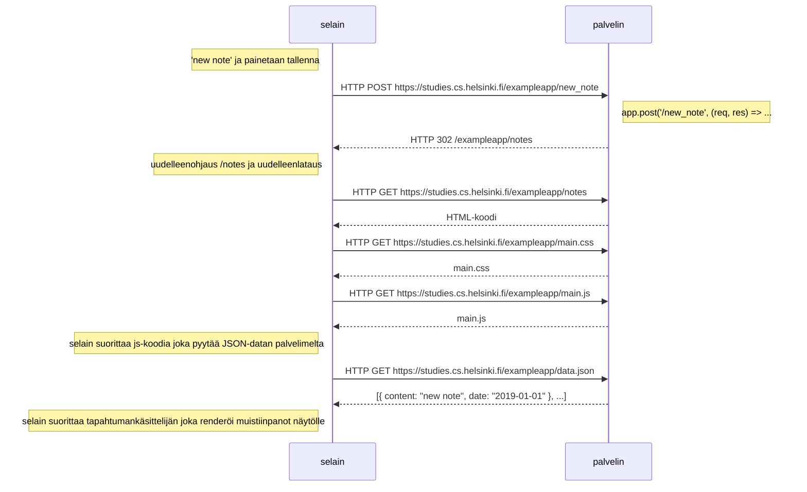

# 0.4

```mermaid
    sequenceDiagram
        note left of selain: 'new note' ja painetaan tallenna
        selain->>palvelin: HTTP POST https://studies.cs.helsinki.fi/exampleapp/new_note
        note right of palvelin: app.post('/new_note', (req, res) => ...
        palvelin-->>selain: HTTP 302 /exampleapp/notes
        note left of selain: uudelleenohjaus /notes ja uudelleenlataus
        selain->>palvelin: HTTP GET https://studies.cs.helsinki.fi/exampleapp/notes
        palvelin-->>selain: HTML-koodi
        selain->>palvelin: HTTP GET https://studies.cs.helsinki.fi/exampleapp/main.css
        palvelin-->>selain: main.css
        selain->>palvelin: HTTP GET https://studies.cs.helsinki.fi/exampleapp/main.js
        palvelin-->>selain: main.js
        note left of selain: selain suorittaa js-koodia joka pyytää JSON-datan palvelimelta
        selain->>palvelin: HTTP GET https://studies.cs.helsinki.fi/exampleapp/data.json
        palvelin-->>selain: [{ content: "new note", date: "2019-01-01" }, ...]
        note left of selain: selain suorittaa tapahtumankäsittelijän joka renderöi muistiinpanot näytölle
```
