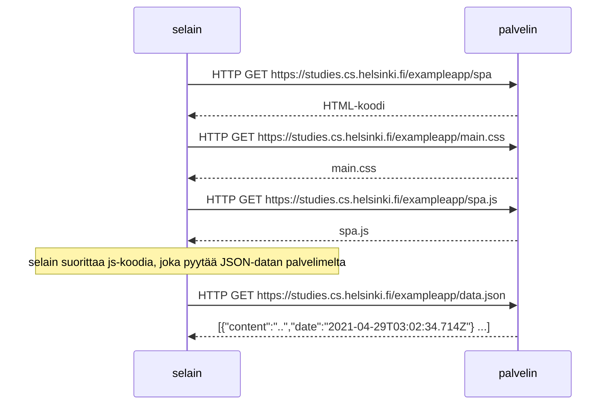

# 0.5

```mermaid
    sequenceDiagram
    selain->>palvelin: HTTP GET https://studies.cs.helsinki.fi/exampleapp/spa
    palvelin-->>selain: HTML-koodi
    selain->>palvelin: HTTP GET https://studies.cs.helsinki.fi/exampleapp/main.css
    palvelin-->>selain: main.css
    selain->>palvelin: HTTP GET https://studies.cs.helsinki.fi/exampleapp/spa.js
    palvelin-->>selain: spa.js
    note over selain: selain suorittaa js-koodia, joka pyytää JSON-datan palvelimelta
    selain->>palvelin: HTTP GET https://studies.cs.helsinki.fi/exampleapp/data.json
    palvelin-->>selain: [{"content":"..","date":"2021-04-29T03:02:34.714Z"} ...]
```
