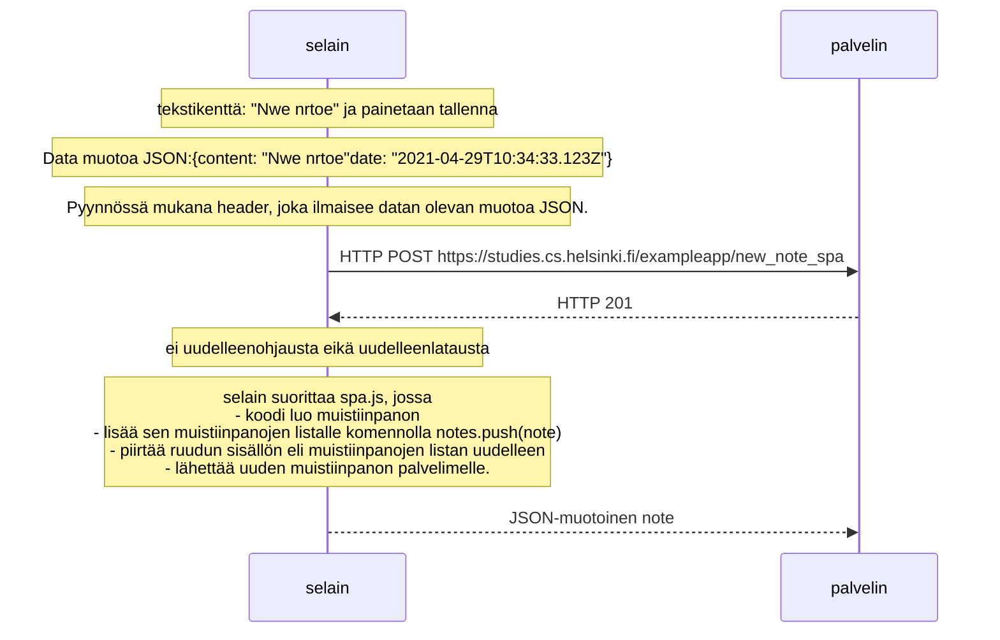

# 0.6

```mermaid
    sequenceDiagram
    note over selain: tekstikenttä: "Nwe nrtoe" ja painetaan tallenna

    note over selain: Data muotoa JSON:{content: "Nwe nrtoe"date: "2021-04-29T10:34:33.123Z"}
    note over selain: Pyynnössä mukana header, joka ilmaisee datan olevan muotoa JSON.

    selain->>palvelin: HTTP POST https://studies.cs.helsinki.fi/exampleapp/new_note_spa
    palvelin-->>selain: HTTP 201

    note over selain: ei uudelleenohjausta eikä uudelleenlatausta

    note over selain: selain suorittaa spa.js, jossa <br> - koodi luo muistiinpanon <br> - lisää sen muistiinpanojen listalle komennolla notes.push(note) <br> - piirtää ruudun sisällön eli muistiinpanojen listan uudelleen <br> - lähettää uuden muistiinpanon palvelimelle.

    selain-->>palvelin: JSON-muotoinen note
```
